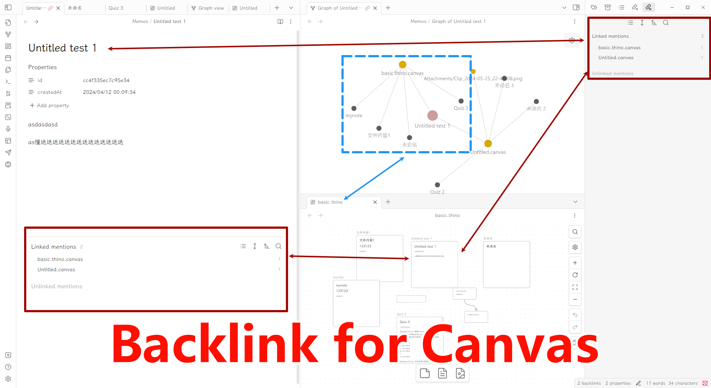

# Backlink for Canvas

A plugin that allows you to view backlinks from canvas.

## How to use

1. Install this plugin and reload Obsidian if necessary.
2. See the backlinks in the backlink panel.
3. Done

## Features

- Show backlinks from Obsidian;
- Show link between nodes in Graph(You need to enable **Show attachment** first.

## Installation

### BRAT

[BRAT](https://github.com/TfTHacker/obsidian42-brat) (Beta Reviewer's Auto-update Tool) is a plugin that allows users to
install Obsidian plugins directly from GitHub with automatic updates.

via Commands:

1. Ensure BRAT is installed
2. Enter the command `BRAT: Plugins: Add a beta plugin for testing`
3. Enter `Quorafind/Obsidian-Backlink-For-Canvas`
4. Click on Add Plugin

via Settings:

1. Ensure BRAT is installed
2. Go to *Settings > BRAT > Beta Plugin List*
3. Click on Add Beta plugin
4. Enter `Quorafind/Obsidian-Search-In-Canvas`
5. Click on Add Plugin

### Manual

Option 1:

1. Go to [Releases](https://github.com/Quorafind/Obsidian-Search-In-Canvas/releases)
2. Download the latest `Obsidian-Backlink-For-Canvas-${version}.zip`
3. Extract its contents
4. Move the contents into /your-vault/.obsidian/plugins/obsidian-backlink-for-canvas/
5. Go to *Settings > Community plugins*
6. Enable Legacy vault switcher

Option 2:

1. Go to [Releases](https://github.com/Quorafind/Obsidian-Search-In-Canvas/releases)
2. Download the latest `main.js`, `styles.css` and `manifest.json`
3. Move the files into /your-vault/.obsidian/plugins/obsidian-backlink-for-canvas/
5. Go to *Settings > Community plugins*
6. Enable Legacy vault switcher

